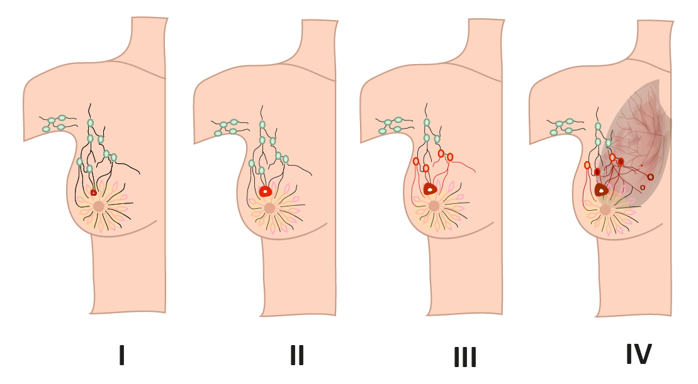

# 🧬 Classificador de Câncer de Mama com Inteligência Artificial

Este é um aplicativo construído com [Streamlit](https://streamlit.io/) que utiliza **Deep Learning com MobileNetV2** para classificar imagens de tecidos mamários em três categorias:

- 🟢 **Benigno**
- 🔴 **Maligno**
- ⚪ **Normal**

A aplicação foi projetada com uma interface intuitiva para facilitar o diagnóstico automatizado com base em imagens.

---

## 📸 Exemplo da Interface



---

## 🚀 Funcionalidades

- Upload de imagens (.jpg, .png)
- Classificação automática baseada em modelo treinado
- Probabilidade de confiança do diagnóstico
- Páginas de navegação:
  - 🏠 Diagnóstico
  - 📚 Informações sobre o Câncer de Mama
  - 📞 Contactos e Apoio

---

## 🛠️ Tecnologias Utilizadas

- Python 3.8+
- Streamlit
- TensorFlow
- TensorFlow Hub
- tf-keras
- NumPy
- Pillow (PIL)

---

## 📦 Instalação

1. Clone o repositório:
```bash
git clone https://github.com/seu-usuario/nome-do-repositorio.git
cd nome-do-repositorio

python -m venv venv
source venv/bin/activate  # No Windows: venv\\Scripts\\activate

pip install -r requirements.txt
